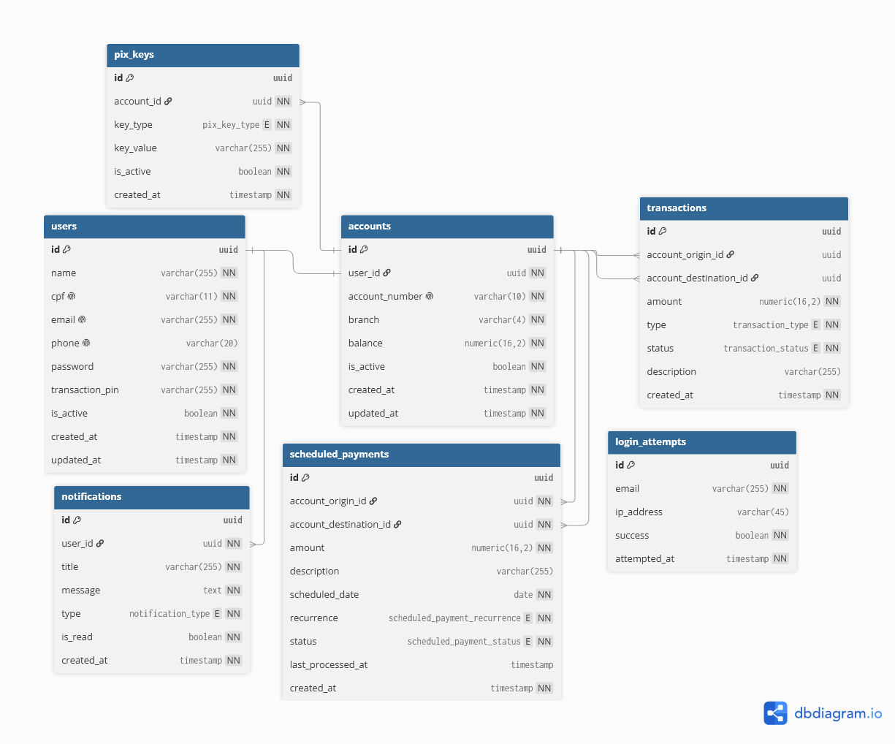

# ArchBank - Backend

A Spring Boot REST API for a personal banking application, handling user accounts, PIX payments, transfers, deposits and withdrawals, with JWT-based stateless authentication.

## Table of Contents

- [Tech Stack](#tech-stack)
- [Project Structure](#project-structure)
- [Authentication](#authentication)
- [Business Rules](#business-rules)
    - [Users and Accounts](#users-and-accounts)
    - [Transactions](#transactions)
- [Database](#database)
- [Swagger](#swagger)
- [Environment Variables](#environment-variables)
- [Running PostgreSQL Locally](#running-postgresql-locally)
- [Other READMEs](#other-readmes)

---

## Tech Stack

- **Java 21** with **Spring Boot**
- **Spring Security** with stateless JWT authentication (via `java-jwt`)
- **PostgreSQL**, with schema versioning through **Flyway**
- **springdoc-openapi** for Swagger/OpenAPI documentation
- **JUnit** and **Mockito** for unit testing

---

## Project Structure

The code is organized by domain rather than by technical layer, each package groups everything related to that domain:

```
com.graciano.archbank
├── account
├── auth
├── config
├── exception
├── notification
├── pix
├── scheduled
├── security
├── transaction
└── user
```

Within each domain package, controllers, services, entities, repositories, DTOs and enums live together, in the folder of the domain they belong to, instead of being split across generic top-level folders like `dtos` or `enums`. For example, transaction-related DTOs and enums live inside the `transaction` package, not in a shared one.

---

## Authentication

Authentication is stateless and based on JWTs.

1. `POST /api/auth/signup` creates a user and its associated account.
2. `POST /api/auth/login` returns a JWT.
3. For any protected endpoint, send the token in the `Authorization` header as `Bearer <token>`.

Requests without a valid token, or with an expired one, receive a `401 Unauthorized` response.

---

## Business Rules

### Users and Accounts

Every user has exactly one account, created automatically during sign-up. There's no endpoint to create an account independently of a user.

### Transactions

All money movement goes through `TransactionCoreService.executeTransaction`, which accepts an optional origin account, an optional destination account, an amount, a type and a description. Each transaction type is a different combination of which side is present, and how the other account is resolved, which is why each one has its own request body.

| Type | Origin | Destination |
| --- | --- | --- | 
| PIX | Authenticated user's account | Resolved from a PIX key |
| Transfer | Authenticated user's account | Resolved from account number + branch 
| Deposit | None (external funds) | Resolved from account number + branch |
| Withdrawal | Authenticated user's account | None (funds leave the system) |

This is why, for example, `DepositRequest` doesn't have an `origin`, there's no account to debit, the money is entering the system from outside. Likewise, `WithdrawalRequest` doesn't take a destination, since the money simply leaves the authenticated user's account.

---

## Database

The schema is managed with Flyway migrations, located under `resources/db.migration`. A full Entity-Relationship Diagram (DER) is available in the repository.



---

## Swagger

Interactive API documentation is automatically generated via [springdoc-openapi](https://springdoc.org/) and is available locally once the application is running:

- **Swagger UI (interactive):** http://localhost:8080/swagger-ui.html
- **OpenAPI specification (JSON):** http://localhost:8080/v3/api-docs

The Swagger UI lets you browse all endpoints, their parameters, request/response examples, and test calls directly from the browser.

For protected endpoints, click **Authorize** at the top of the page and provide the JWT token obtained from `/api/auth/login` in the format `Bearer <token>`.

---

## Environment Variables

This project reads its configuration from a `.env` file in the backend project root (loaded automatically via `spring-dotenv`).
Copy the example and adjust as needed:

```bash
cp .env.example .env
```

| Variable      | Description                              |
| ------------- | ------------------------------------------ |
| `DB_HOST`     | PostgreSQL host                            |
| `DB_PORT`     | PostgreSQL port                            |
| `DB_NAME`     | PostgreSQL database name                   |
| `DB_USERNAME` | PostgreSQL username                        |
| `DB_PASSWORD` | PostgreSQL password                        |
| `JWT_SECRET`  | Secret used to sign JWTs                   |

## Running PostgreSQL Locally

The command below spins up a local Postgres instance matching the **default** values in `.env.example`. If you change
your DB credentials in `.env`, update this command (or your own Postgres setup) to match:

```bash
docker run --name archbank-db -e POSTGRES_DB=archbank -e POSTGRES_USER=postgres -e POSTGRES_PASSWORD=postgres -p 5432:5432 -d postgres:16
```

You're not required to use this exact command, any Postgres instance works, as long as its credentials match what's in your `.env`.

---

## Other READMEs

This README covers only the **backend**. Continue reading the project's documentation.

Read the frontend documentation: [FRONTEND_README](./../frontend/FRONTEND_README.md)

Read the project documentation: [README](./../README.md)